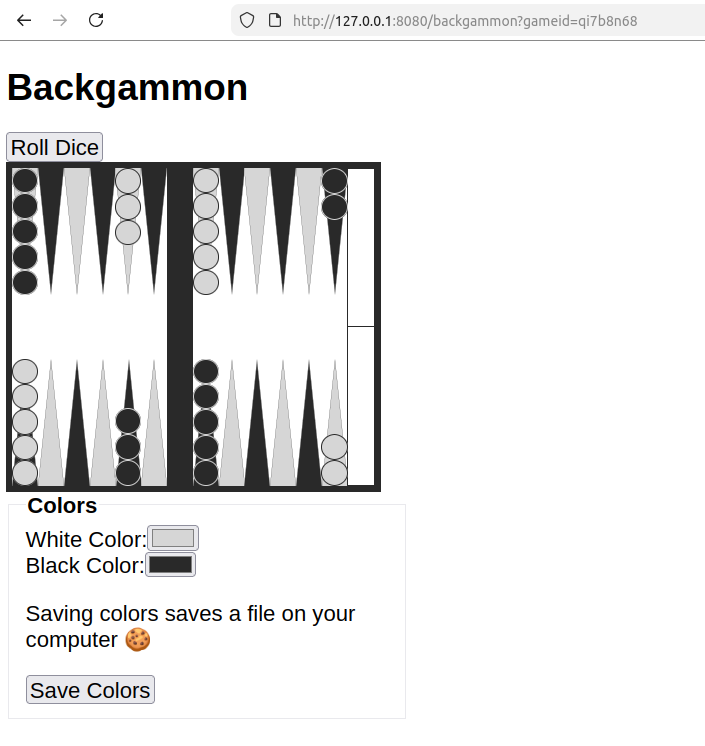

## Backgammon-demo

Backgammon board in the browser, built with [ISSR](https://github.com/interactive-ssr/issr-server/blob/master/main.org).



### Run

```lisp
(ql:quickload "backgammon-demo")

(backgammon:start-server)
```

And visit http://127.0.0.1:8080/backgammon
